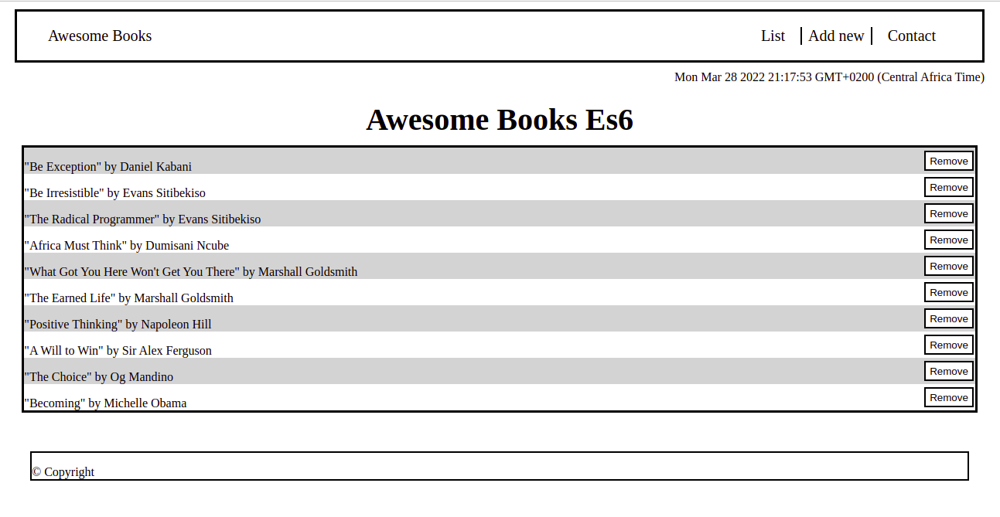

# Awesome Book With ES6
> Awesome Book Project

# Built With

- Html
- Css
- Js
- Git & Gitflow

## Getting Started
To run the above project you need to meet the following requirements:
## Prerequisites
- Have [Vscode](https://code.visualstudio.com/) installed 
- Have [Git](https://git-scm.com/) installed

## Run
> To run the above project :
> Run the following commands on your terminal of choice

- git clone <url>
- cd /dir
- open the project in vscode 

## Author

👤 **Evans Sitibekiso**

- GitHub: [@evans22j](https://github.com/evans22j)
- Twitter: [@Evans_22J](https://twitter.com/Evans_22J)
- LinkedIn: [Evans Sitibekiso](https://www.linkedin.com/in/evans-sitibekiso-a85753202/)

## 🤝 Contributing

Contributions, issues, and feature requests are welcome!

Feel free to check the [issues page](../../issues/).

## Show your support

Give a ⭐️ if you like this project!
  

